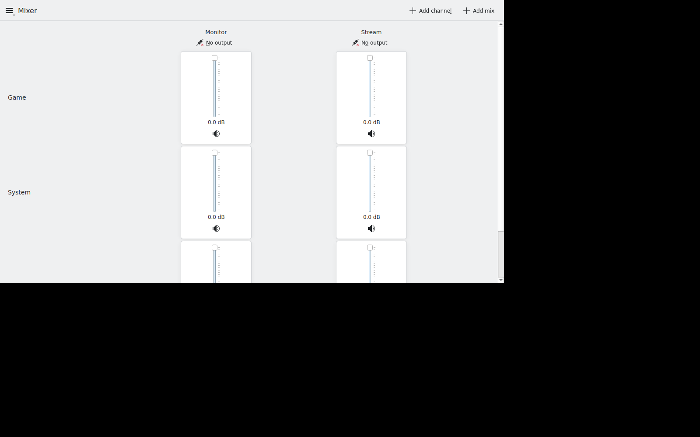

# kmixdeck

**A streamer's audio mixer for KDE Plasma, built on PipeWire.**

Route every application into its own channel, build as many output mixes as you need (what *you*
hear vs. what the *stream* hears vs. …), and set each channel's level independently per mix. Think
Elgato Wave Link — for Linux, without the hardware lock-in and without the artificial limits.



*KDE CI* · *PipeWire-native* · *GPL-3.0-or-later*

## Why

There is no Wave Link / VoiceMeeter / Sonar equivalent on Linux. PipeWire has every primitive needed
(virtual sinks, loopbacks, per-app routing), but the tooling stops at patchbays (qpwgraph, Helvum)
and plain volume controls (pavucontrol). The one project that tried to fill the gap,
[Sonusmix](https://codeberg.org/sonusmix/sonusmix), is unmaintained since 2025 and never solved
independent per-mix levels ([#72](https://codeberg.org/sonusmix/sonusmix/issues/72)). See
[ADR 0001](docs/adr/0001-new-project-not-a-fork.md) for why this is a new project rather than a fork.

## What you get

- **Channels × mixes** — channels (*Game*, *System*, *Voice*, …) down, mixes (*Monitor*, *Stream*,
  any number you add) across; one fader per intersection, levels per mix that never leak into each
  other. Measured, not assumed: −12.0 / +6.0 / −∞ dB on the wire (ADR 0002).
- **Per-mix hardware output + virtual capture source** — the monitor mix goes to your headphones,
  the stream mix is exposed as `kmixdeck.source.stream` for OBS/Discord to pick as their input
  device (ADR 0007).
- **Devices that survive real life** — identified by stable `node.name`; unplugging and replugging a
  headset parks the affected output and re-links it automatically; multi-PCM interfaces (RØDECaster,
  Ui24R) show each PCM as its own row with its channel labels.
- **Live level meters** — peaks in the UI at ~25 Hz over a single D-Bus signal that only runs while
  somebody listens (ADR 0006).
- **KDE-native** — Qt 6 / Kirigami, tray via KStatusNotifierItem, global shortcuts via
  KGlobalAccel (works on Wayland), Plasma-consistent cubic fader curve.
- **Kill the app, audio keeps flowing** — the whole graph is plain PipeWire objects from a generated
  config fragment; the service is only the control plane.

## Quick start

```sh
cmake -S . -B build -G Ninja && ninja -C build
pip install pytest pulsectl                       # integration tests: pytest + PulseAudio client (CT-5, talks to pipewire-pulse)
sudo apt install gettext                          # UX-5 test: msgfmt/xgettext; a de_DE.UTF-8 glibc locale (or ~/.local/lib/locale via localedef) for the German window probe
ctest --test-dir build --output-on-failure      # QTest units + PipeWire sandbox integration (needs pipewire, wireplumber, pipewire-pulse, ffmpeg)

./build/bin/kmixdeckd &        # normally started by D-Bus activation
./build/bin/kmixdeck status    # CLI — every command also speaks --json
./build/bin/kmixdeck-kde       # Kirigami UI
```

Typical CLI session:

```sh
kmixdeck cell set game stream 25%     # −12 dB in the stream mix only
kmixdeck mix output stream fake.headphones
kmixdeck devices                      # hardware outputs, node.name → description
kmixdeck levels                       # live peak meters
```

Try the audio graph **without any kmixdeck process** — it is plain PipeWire config:

```sh
cp prototype/kmixdeck-prototype.conf ~/.config/pipewire/pipewire.conf.d/
systemctl --user restart pipewire wireplumber
pactl list short sinks | grep kmixdeck     # channels, mixes; kmixdeck.source.stream for OBS
```

## How it fits together

```
applications ──▶ channel sinks ──(loopback = fader)──▶ mix sinks ──▶ headphones / OBS
                                                    └▶ kmixdeck.source.<mix>
kmixdeckd ── owns the graph ── exports org.kmixdeck1 on the session bus
     ▲            ▲            ▲
  kmixdeck     kmixdeck-kde   your frontend
```

Full write-up with diagrams: [docs/architecture.md](docs/architecture.md).
Writing your own frontend? [docs/frontend-guide.md](docs/frontend-guide.md) — D-Bus is the only
dependency; the introspection XML in [`interfaces/`](interfaces/) is the checked contract.

## Repository layout

```
docs/architecture.md   how the pieces fit (this file's longer version)
docs/frontend-guide.md D-Bus contract + examples for third-party UIs
docs/spec/             requirements (what), numbered and testable; test strategy
docs/adr/              architecture decision records (why), 0001…0007
docs/research/         source material: competitor inventory, user feedback
interfaces/            the D-Bus introspection XML (the API contract)
prototype/             hand-written reference of the generated PipeWire config
src/                   kmixdeckd · kmixdeck · kmixdeck-kde
tests/                 QTest units + pytest integration against a private PipeWire
```

## License

GPL-3.0-or-later (KDE ecosystem standard). See [LICENSE](LICENSE).

## Translations

English is the source language, German ships in `po/de/`. After adding or changing an `i18n()` string:

```sh
sh tools/extract-messages.sh      # refresh po/kmixdeck.pot and merge into every po/<lang>/kmixdeck.po
$EDITOR po/de/kmixdeck.po         # translate what msgmerge marked fuzzy/empty
```

`ctest` fails on a stale `.pot` or an incomplete German catalog (`test_ux5_*`). Running from the build tree:
`KMIXDECK_LOCALE_DIR=build/locale LANGUAGE=de build/bin/kmixdeck-kde`.

## Stream Deck

`kmixdeck streamdeck install` hooks the OpenAction plugin into OpenDeck; see [streamdeck/README.md](streamdeck/README.md).
