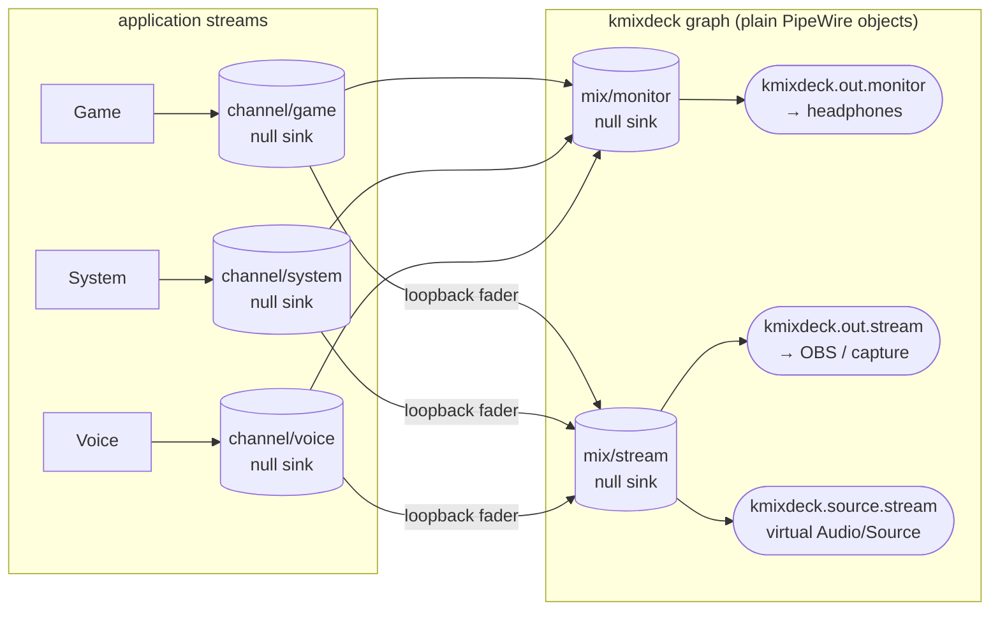
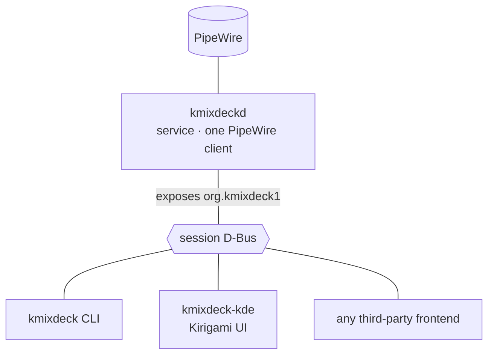

# kmixdeck architecture

One paragraph version: **kmixdeck is a PipeWire graph with a D-Bus face.** A background service
(`kmixdeckd`) is the only PipeWire client; it owns the matrix of null sinks and loopbacks, keeps it in
sync with a small JSON layout file, and exports everything on the session bus as `org.kmixdeck1`.
Every frontend — the Kirigami UI, the CLI, your own app — is a plain D-Bus client.

## The audio graph (ADR 0002)

- **Channel** = a passive null sink (`kmixdeck.channel.<slug>`). Applications are assigned to it via
  `node.target`; WirePlumber persists that mapping (`state.restore-target`), keyed on the stream's
  identity — so an app that restarts lands on the same channel.
- **Mix** = a non-passive null sink (`kmixdeck.mix.<slug>`).
- **Cell** (channel × mix) = one `libpipewire-module-loopback` instance capturing the channel's
  monitor and playing into the mix. **Its playback stream volume *is* the fader** — PipeWire's own
  per-stream `channelVolumes`, so levels survive service restarts for free.
- Every one of our streams carries `node.dont-fallback` so a missing target never silently lands on
  the default sink (that feedback loop cost us a whole evening; see ADR 0002 field notes).

The entire graph above is also emitted as a `pipewire.conf.d` fragment — see *Persistence* below —
so audio keeps flowing even when `kmixdeckd` is not running.

## The process split (ADR 0005)

Three binaries, one service:

| Binary | Role | Talks to |
|---|---|---|
| `kmixdeckd` | owns the graph, meters, persistence | PipeWire + exports D-Bus |
| `kmixdeck` | shell/script control, `--json`, stable exit codes | pure D-Bus client |
| `kmixdeck-kde` | Kirigami matrix UI, tray, global shortcuts | pure D-Bus client |

The frontend guide ([docs/frontend-guide.md](frontend-guide.md)) is the contract for the last row:
bootstrap with `GetManagedObjects()`, stay live on `PropertiesChanged`, write with `Properties.Set`.
The introspection XML in [`interfaces/`](../interfaces/) is checked against the running daemon by an
integration test on every push — the contract cannot drift silently.

## Devices and absence (ADR 0007)

Devices are identified by `node.name` — stable across replug and reboot — never by index or
description. Multi-PCI-card devices (RØDECaster, Ui24R) expose one node per PCM; the UI lists them as
rows of the same card with their `audio.position` labels (`FL FR`, `AUX2`, …). Mix outputs reference a
device plus an optional channel-subset, so a mix can play to `FL FR` of a 22-channel interface and a
second mix to `AUX0 AUX1`.

While a device is absent its loopback parks on the hidden `kmixdeck.null` sink (priority 0, passive —
it never wins the default-sink lottery); when the device reappears, `node.linger` keeps the stream
alive and WirePlumber re-links it. The UI greys the device out rather than dropping it.

## Persistence — three layers, each with one job

| Layer | File / mechanism | Survives |
|---|---|---|
| Declared layout | `~/.config/kmixdeck/layout.json` | edits to channels/mixes/outputs |
| Generated graph | `~/.config/pipewire/pipewire.conf.d/90-kmixdeck.conf` | login without the service; service crashes |
| Live state (fader values, app→channel routes) | WirePlumber `state.restore-*` | everything it already keys on |

The layout file is the source of truth; the conf fragment is rendered from it (same
`loopbackArgs()` code path for runtime and file, so they cannot drift). Fader values are deliberately
*not* duplicated into our JSON — PipeWire already persists them and does it per-stream, keyed by our
stable node names.

## Levels (ADR 0006)

Metering would flood a D-Bus connection at audio rate. Instead the daemon samples peaks at ~25 Hz and
emits **one** `Peaks` signal per tick on `org.kmixdeck1.Levels` — and only while someone is
subscribed. First `Subscribe()` starts the meter graph, the last `Unsubscribe()` stops it after a
short grace period. Frontends never poll.
