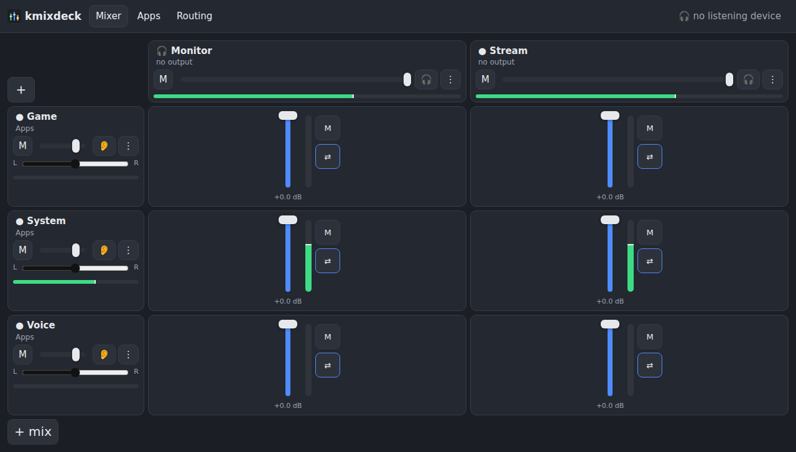

# The web UI — kmixdeck in a browser

`kmixdeck-web` serves the mixer to any browser on your machine or your LAN: a phone next to the microphone, a tablet on the
desk, a laptop in another room — or the desk PC itself when it runs headless (ADR 0011, AR-8). It has the same features as
the window: mixer grid with live meters, apps, patchbay, effects, export/import, undo.



## Start it

```sh
kmixdeck-web                 # http://127.0.0.1:7420 — this machine only, no token
kmixdeck-web --lan           # every interface, token required; prints the URL with the token to open on the phone
kmixdeck-web --port 8080     # another port
```

For the phone use case, enable it once and forget it:

```sh
systemctl --user enable --now kmixdeck-web      # LAN mode; disabled by default because it opens a port
```

**Requirements:** the kmixdeck service running on the same machine (it is started on demand), Python 3 with `python3-gi`
and `python3-websockets ≥ 11`. If one is missing the bridge says which package to install and exits.

## Security model

- **Localhost by default.** Without `--lan` the bridge binds `127.0.0.1` and asks for no token.
- **Token on the LAN.** `--lan` binds all interfaces and requires the token from `~/.config/kmixdeck/web-token` (created
  on first start, mode 0600). It is compared in constant time. The token travels in the URL **fragment** — it is never sent
  to the server as HTTP, only inside the WebSocket hello — and is kept in `sessionStorage`, so it dies with the tab.
- **Same-origin only.** A WebSocket upgrade from another origin (a page you visited, a `file://` page) is refused with
  403 — a tab from elsewhere cannot drive your mixer even on localhost.
- **Allowlist.** The bridge forwards only the D-Bus methods and properties named in the daemon's own introspection; anything
  else is refused. It never touches PipeWire itself (AR-6).
- **Static files are jailed** to the UI directory; frames are capped at 1 MiB.
- Anyone with the token controls your audio. Treat it like a password: `--lan` prints a warning for that reason.

## What is on the page

**Mixer** (default tab). Channels are rows, mixes are columns, like the window. Each row: icon, name, the channel's source
line (click → hardware-input picker), mute, then one **cell** per mix — a fader with the live meter in its track, a mute and a
link button. Each column header: mix name, the output picker (tick several outputs at once), master fader with its meter,
mute, **listen** (hold to audition), FX. The ⋮ menus on rows and columns hold rename, icon, colour, move, duplicate,
remove. **I hear:** at the top shows which mix goes to your listening device — one tap switches. Ctrl+Z undoes the last
removal.

**Apps.** Every application stream with its live level and running state; tap a channel chip to assign, tap again to
remove. Several chips = the app plays into several channels (first = primary).

**Loudness (EBU R128).** Per mix, from the column's ⋮ menu → *Loudness meter*. The header then shows **M** · **S** · **I**
in LUFS plus the true peak (`TP`), refreshed from the same 25 Hz loop as the meters, and the master meter gets a dashed
target line. *Loudness target…* asks for a number between −40 and 0 (−14 streaming, −23 EBU R128 broadcast) — the window
offers a fixed list of five instead, the daemon accepts the same range from both. A reading of `–` means silence
(below −70); **I** keeps its value after the audio stops, M and S fall back.

**Soundboard.** A tab of pads, one per sample. *+ Sample* adds a file, *Stop all* silences the board, *×* removes a pad.
A soundboard is itself a channel that plays files, so the samples go through the daemon's graph into the stream and your
headphones — the tab only exists once such a channel exists.

**Scenes.** The toolbar carries a *scene* picker and a save button. Saving stores every fader, mute, the listening device and
the FX bypass states under a name; picking one recalls it in a single undoable pass. The picker reads `no scenes` until you
have saved one. A scene deliberately does not carry the channel/mix set or the wiring, so it still fits after a rename or a
repatch.

**Patchbay.** Three columns — sources → channels → mixes → outputs — with every wire drawn. Drag from a jack to a jack to
create a wire; click a wire for per-wire trim, mute and remove. Devices that are unplugged stay in place, greyed.

**FX drawer** (the FX button on a row or column). The chain of the selected channel or mix: catalog, presets, bypass per
effect, live sliders that change the running node without a reload.

**Export / Import** (top right, or Ctrl+S). Export downloads the daemon's backup document (layout + every level). Import takes
such a file, asks once, and replaces the running layout; a broken file is refused with a message and nothing changes.

**Reconnect.** If the bridge or the daemon goes away, the page says so and reconnects by itself (backoff 0.5 → 8 s); the
first frame after reconnect is a full snapshot, so what you see is never stale.

## How it talks to the daemon

One WebSocket. The first frame from the client is `{"op":"hello","token":"…"}`; the server answers with a full
`{"op":"snapshot","state":{…}}` of the object tree and then streams `{"op":"patch",…}` (RFC 7386 merge patches) as
properties change, plus `{"op":"meters","peaks":{…}}` at the daemon's 25 Hz while any meter is visible. The client sends
`{"op":"set", path, iface, prop, value}` and `{"op":"call", path, iface, method, args}`; a refused write comes back as
`{"op":"error", …}` and the UI shows it as a toast. Latency over WLAN in the same house: median 5 ms, p95 11 ms (measured),
so faders feel direct. No audio crosses the wire — only control and meters.

The UI is plain ES modules in `web/static/` — no build step, no framework. `app.js` (tabs, undo, export/import),
`client.js` (socket, state, patches), `mixer.js`, `apps.js`, `patchbay.js`, `fx.js`, `duck.js`, `widgets.js`. Every interactive element
carries a `data-probe` attribute; that is what the integration tests drive.

## Play endpoint — audio into a channel over HTTP (opt-in)

For a program on another machine that wants to play audio into one channel — text to speech rendered elsewhere, a
music player — the bridge can open a second, separate listener (CT-10, ADR 0016). The daemon itself never listens on
the network; this is the one place that does.

```sh
kmixdeck channel playback tts_voice on             # the channel must accept playback (off by default)
kmixdeck-web --play 0.0.0.0:7421                   # prints the endpoint; the token is in ~/.config/kmixdeck/play-token
```

- **Own token, own scope.** `--play` uses `$XDG_CONFIG_HOME/kmixdeck/play-token` (created on first use, mode 0600; `--play-token`
  overrides it for tests), compared in constant time. It is not the web-UI token and the web-UI token does not open it. With it a
  client can only play audio into a channel whose **Accept playback** switch is on — no faders, no routing, no state.
- `POST /channel/<slug>/play[?title=<urlencoded>]` with `Authorization: Bearer <token>` and a `Content-Length` (no chunked
  bodies); the body is an audio file (WAV, FLAC, OGG, MP3, AAC/M4A, MKA/WebM). It is held in RAM (a memfd), never written to disk.
  The request **blocks until the clip ended** and then answers, as JSON:

  | Status | Body | When |
  |---|---|---|
  | 200 | `{"ok":true,"id":N,"result":"played"}` | the clip was played to its end |
  | 410 | `{"ok":false,"id":N,"result":"stopped"}` | stopped (`kmixdeck channel stop`, the window, the switch went off, the channel was removed) |
  | 422 | `{"ok":false,"id":N,"result":"error: …"}` | the body could not be decoded |
  | 401 | `{"ok":false,"error":"…"}` | missing or wrong token |
  | 404 | | no such channel |
  | 409 | | the channel's playback switch is off (the message names the command that turns it on) |
  | 400 / 411 | | bad or missing `Content-Length`, chunked body |
  | 413 | | body larger than `--play-max-bytes` (default 64 MiB) |
  | 503 | | the channel's queue (8 tracks) is full, too many requests in flight, or the daemon is not on the bus |

  401 to 413, the playback switch, and "too many requests in flight" are decided from the headers, before a byte
  of the body is read. A full queue is the daemon's answer (`org.kmixdeck1.Error.QueueFull`): the bridge keeps no
  copy of the limit, so that 503 comes after the upload.
- Clips queue up per channel and play one after the other. **A client that disconnects while waiting** (it timed out, it
  gave up) has its clip stopped: a queued clip is never played late.
- `GET /healthz` (no token): `200 {"ok":true}` while the daemon is on the bus, otherwise `503`.

```sh
curl -sS -H "Authorization: Bearer $(cat ~/.config/kmixdeck/play-token)" --data-binary @hello.wav \
     "http://desk:7421/channel/tts_voice/play?title=Hello"
```

The `systemd` unit does not pass `--play`; add it to an override if you want the endpoint permanently.

## Proven by

`tests/integration/test_web.py` — 16 tests in headless Chrome, every step checked at the CLI: bridge + allowlist + token +
origin, meters at 25 Hz, static-file jail, mix end-to-end (add → rename → output → fader → mute → link → remove → undo), app
chips, patchbay menu and drag, FX drawer, export/import round trip, reconnect. The six `tier:core` rows of the requirements
are additionally proven in the browser by `test_frontends_sync.py` next to CLI, window and tray. The play endpoint is proven by the
`test_ct10_web_*` tests in `tests/integration/test_playback.py`: a clip is audible and answered 200 only after it ended, refusals
before the body, result mapping, a disconnecting client's queued clip never sounds, healthz follows the daemon.
