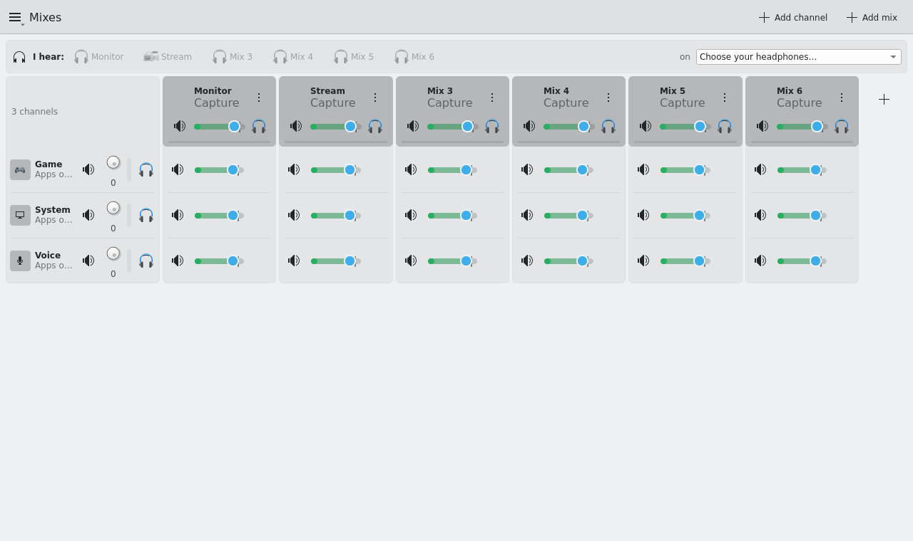

# The window — `kmixdeck-kde`

The Kirigami desktop app: a Plasma-native front end for the kmixdeck service. It is one client among several (CLI, web,
Stream Deck, tray); everything it shows comes from the D-Bus tree, everything it changes goes back through it — so any change
made here is visible in the other frontends within a frame, and vice versa.

## Starting

`kmixdeck-kde` from the launcher, or `kmixdeck-kde` in a terminal. The service starts on demand. The window is single-instance
(a second start raises the first). There is no autostart entry on purpose: **the audio graph exists without the window** —
PipeWire builds it at login from a config the service writes — and the tray icon comes with the window.

First start with nothing configured: a **Set up defaults…** dialog offers *Monitor* → your default output, *Voice* ← your default
microphone, running apps sorted into channels by their media role. One click applies it; nothing is done without it.

## The mixer page

Channels are **rows**, mixes are **columns** (like Wave Link). At each intersection sits a **cell**: the level of that channel in
that mix, with its own mute and a live meter in the fader track. A cell moves nothing but itself — game at −12 dB in *Stream*
leaves *Monitor* untouched.

**Row header (channel):** icon, name, source line (which hardware input / apps feed it), mute, group, ⋮ menu — rename,
icon, colour, move up/down, group, pan, hardware input, remove. The **listen** button (headphones) auditions this channel on
your main output while held; release restores everything exactly.

**Column header (mix):** icon, name, output picker (tick several hardware outputs at once — headphones and a USB interface,
say), master fader with meter, mute, listen, **FX**, ⋮ menu — rename, icon, colour, move, duplicate, output, fallback output,
remove. The mix is also exposed as the capture source `kmixdeck.source.<slug>` — pick that in OBS or Discord as the input.

**Link.** The chain button on a cell makes it follow the same channel's cell in another mix (volume and mute). Touching the
follower breaks the link.

**I hear:** the bar above the grid shows which mix is on your listening device right now; one click switches. Eight mixes fit
in 1280 px; columns share the width instead of scrolling.

**Undo** (Ctrl+Z, or the toolbar arrow) restores the last removed channel or mix with its cells, outputs and FX.

## Other pages

**Applications.** Every stream with icon, live level and running state; assign it to one or several channels with chips.
Where never-seen apps land is the *default channel* (⋮ on a channel → "Default for new apps").

**Routing.** The matrix as a table: what feeds what, per side (L/R) where a device has more ports than a stereo pair.

**Patchbay.** Sources → channels → mixes → outputs with wires drawn; drag jack to jack to wire, click a wire for per-wire trim,
mute and remove. A 32-in/32-out interface (Ui24R class) shows all its ports; each port can be a channel of its own.

**FX** (panel from any FX button). Ordered insert chain per channel or mix: catalog, presets, bypass, live sliders. LADSPA
effects (noise suppression, gate, compressor) appear when the plugin library is installed; builtin ones always.

## Menu

*Add channel…* · *Add mix…* — one picker for everything a channel can be fed by: running apps (with level), hardware inputs,
or "empty (apps only)". *Set up defaults…* — the first-run plan again. *Hidden devices…* — devices you have hidden from every
picker (still routable by name). *Export settings…* / *Import settings…* — backup and restore of layout + every level.

## Tray

A StatusNotifierItem while the window runs: click for the overview — listening device, how many apps are playing, every mix
with its level, one-click listen switch. Middle-click mutes the listening mix.

## Global shortcuts

Registered with KGlobalAccel (works on Wayland), no default keys: *Mute channel: X*, *Mute mix: X*, *Mix X: volume up/down*,
*Listen to next mix*. Assign them in **System Settings → Shortcuts → kmixdeck** (the tray menu's *Configure Shortcuts…* opens exactly that
page). A mute via shortcut shows a notification.

## Language

English first; German ships in `po/de/`. The window follows your Plasma language.

## Keyboard

Every control is reachable with Tab and carries an accessible name (tested). Faders: arrows ±1 dB (Shift: ±3 dB), Page Up/Down ±6 dB, Home = −∞, End = 0 dB.

## For developers

`kmixdeck-kde --screenshot out.png [--open <target>] [--size 1280x760]` renders the window offscreen;
`--probe <objectName>.<property>` prints one UI value; `--self-test` loads the QML and exits non-zero on any warning. The
integration tests use these to prove that the window shows what the daemon holds (`tests/integration/test_presentation.py`,
`test_frontends_sync.py`).

`--open` targets: `apps`, `routing`, `patchbay`, `channel-ports`, `fx/channel/<slug>`, `fx/mix/<slug>`.
An unknown target is reported on stderr instead of being ignored — it used to vanish silently, which
made a probe against a page that was never opened look like a QML bug.

Two traps worth knowing before you write a window test:

- **A dialog pushed with `pushDialogLayer()` is its own window on the desktop**, not an entry in
  `pageStack.layers` (see Kirigami's `PageRow.qml`, branch "open as a new window"). `--probe`
  therefore searches every top-level window, not just the main one. Checking `layers.depth` to
  see whether a dialog opened gives the wrong answer on desktop.
- **Whatever you push must be a Page.** `pushDialogLayer()` runs `verifyPages()` and answers a
  non-Page with a `console.warn` plus `null`, so nothing opens and no error reaches the shell.
  `FxPanel.qml` had a `Kirigami.FormLayout` root for months: the "Effects…" button did nothing,
  and no test noticed because the FX tests went through the CLI and the browser, while
  `--self-test` only loads the file without pushing it (fixed 2026-09-21, FX-8).
